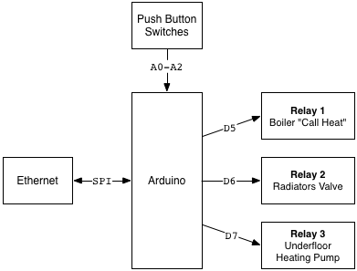

Heating Controller
==================

Relays
------

*Model*: Omron [G2R-1-S-DC12]
*Coil Rating*: 12V DC / 43.2 mA
*Contact Rating*: 10A at 250 VAC

| Relay | Description          |  Device                    | Voltage | Current       |
|-------|----------------------|----------------------------|---------|---------------|
| 1     | Boiler Call for heat | [Vaillant ecoTEC plus 831] | 230v AC | ?             |
| 2     | Radiator Zone Valve  | [Honeywell V4043]          | 230v AC | 2.2 amps      |
| 3     | Underfloor Heating   | [Grundfos UPS2]            | 230v AC | 0.06A - 0.42A |

